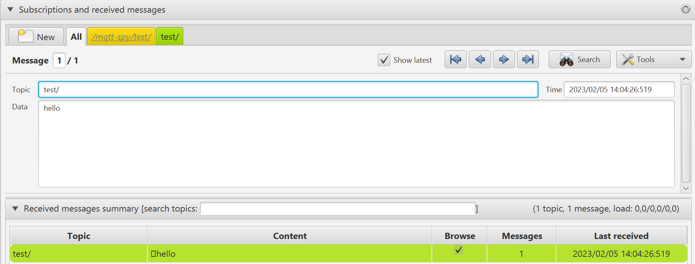

# MQTT Binary Stream Client Demo - Tristan Perrot

This is how I write a binary stream to a MQTT broker without using the paho library.

**1. First I am connecting to the MQTT Broker using SocketIO.**

```java
// Connect to the MQTT broker
try (Socket socket = new Socket("localhost", 1883)) {
    // Get the input and output streams
    InputStream in = socket.getInputStream();
    OutputStream out = socket.getOutputStream();
```

**2. Then I define the connect message byte per byte and write it .**

```java
// Define the CONNECT message byte array
// Set the command type (CONNECT) and control flags to 0
// Set the protocol name length to 4 (for "MQTT")
// Set the protocol level to 4 (for MQTT v3.1.1)
// Set the connect flags to 2 (clean session = true)
// Set the keep alive timer to 60 seconds (in seconds)
byte[] connectPacket = {
        0x10, // Command type and control flags
        0x13, // Remaining length
        0x00, 0x04, // Protocol name length
        'M', 'Q', 'T', 'T', // Protocol name
        0x04, // Protocol level
        0x02, // Connect flags
        0x00, 0x3c, // Keep alive timer
        0x00, 0x07, // Client ID length
        'T', 'r', 'i', 's', 't', 'a', 'n' // Client ID
};

// Send the CONNECT message to the broker
out.write(connectPacket);
```

**3. Then I read the response from the broker.**

```java
// Read the broker's response message (CONNACK)
byte[] connackPacket = new byte[4];
in.read(connackPacket);

// Display the contents of the CONNACK message, byte by byte
System.out.println("CONNACK message: ");
for (byte b : connackPacket) {
    System.out.printf("0x%02x ", b);
}
```

and I get that response:

```bash
CONNACK message:
0x20 0x02 0x00 0x00
```

*How many bytes did the CONNACK message contain? What were their values? What is your interpretation of the byte values in the received CONNACK message? Do they make sense?*

The CONNACK message contains 4 bytes. The first byte is the command type and control flags. The second byte is the remaining length. The third and fourth bytes are the connect acknowledge flags. The first bit is the session present flag. The second bit is the connect return code. The connect return code is 0 which means the connection was accepted.

**4. Then I define the publish message byte per byte, write it and read the connack message.**

```java
// Define the PUBLISH message byte array
byte[] publishPacket = {
        0x30, // Command type and control flags
        0x0e, // Remaining length
        0x00, 0x05, // Topic length
        't', 'e', 's', 't', '/', // Topic
        0x00, 0x05, // Message length
        'h', 'e', 'l', 'l', 'o' // Message
};

// Send the PUBLISH message to the broker
out.write(publishPacket);

// Read the broker's response message (PUBACK)
byte[] pubackPacket = new byte[4];
in.read(pubackPacket);

// Display the contents of the PUBACK message, byte by byte
System.out.println("PUBACK message: ");
for (byte b : pubackPacket) {
    System.out.printf("0x%02x ", b);
}
```

and I get that on MQTT-spy :



**Here is the full code:**

```java
package mqtt;

import java.io.IOException;
import java.io.InputStream;
import java.io.OutputStream;
import java.net.Socket;

public class MQTTClient {
    public static void main(String[] args) {
        // Connect to the MQTT broker
        try (Socket socket = new Socket("localhost", 1883)) {
            // Get the input and output streams
            InputStream in = socket.getInputStream();
            OutputStream out = socket.getOutputStream();

            // Define the CONNECT message byte array
            // Set the command type (CONNECT) and control flags to 0
            // Set the protocol name length to 4 (for "MQTT")
            // Set the protocol level to 4 (for MQTT v3.1.1)
            // Set the connect flags to 2 (clean session = true)
            // Set the keep alive timer to 60 seconds (in seconds)
            byte[] connectPacket = {
                    0x10, // Command type and control flags
                    0x13, // Remaining length
                    0x00, 0x04, // Protocol name length
                    'M', 'Q', 'T', 'T', // Protocol name
                    0x04, // Protocol level
                    0x02, // Connect flags
                    0x00, 0x3c, // Keep alive timer
                    0x00, 0x07, // Client ID length
                    'T', 'r', 'i', 's', 't', 'a', 'n' // Client ID
            };

            // Send the CONNECT message to the broker
            out.write(connectPacket);

            // Read the broker's response message (CONNACK)
            byte[] connackPacket = new byte[4];
            in.read(connackPacket);

            // Display the contents of the CONNACK message, byte by byte
            System.out.println("CONNACK message: ");
            for (byte b : connackPacket) {
                System.out.printf("0x%02x ", b);
            }

            // Define the PUBLISH message byte array
            byte[] publishPacket = {
                    0x30, // Command type and control flags
                    0x0e, // Remaining length
                    0x00, 0x05, // Topic length
                    't', 'e', 's', 't', '/', // Topic
                    0x00, 0x05, // Message length
                    'h', 'e', 'l', 'l', 'o' // Message
            };

            // Send the PUBLISH message to the broker
            out.write(publishPacket);

            // Read the broker's response message (PUBACK)
            byte[] pubackPacket = new byte[4];
            in.read(pubackPacket);

            // Display the contents of the PUBACK message, byte by byte
            System.out.println("PUBACK message: ");
            for (byte b : pubackPacket) {
                System.out.printf("0x%02x ", b);
            }
        } catch (IOException e) {
            e.printStackTrace();
        }
    }
}
```
